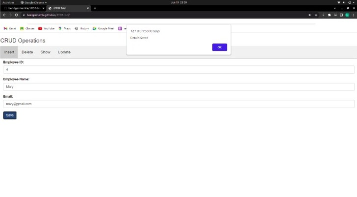

# JPDB-trial
 It is a trial website using JPDB for performing CRUD operations.

## JSONPowerDB
- **JsonPowerDB** is a Real-time, High Performance, Lightweight and Simple to Use, Rest API based Multi-mode DBMS. JsonPowerDB has ready to use API for Json document DB, RDBMS, Key-value DB, GeoSpatial DB and Time Series DB functionality. JPDB supports and advocates for true serverless and pluggable API development.

## Benefits of using JsonPowerDB
- Nimble, simple to use, in memory, real time 
- Schema free - easy to maintain
- Serverless support - fast development - cuts time to market
- Built around the world's fastest indexing engine PowerIndex
- Webservices API - Low Dev Cost
- Multiple Security Layers
- A single instance - Million Indexes
- Inbuilt support for querying multiple databases
- Serverside Native NoSQL - best performance
- Multi-mode database - One solution to a variety of data
*It is truly a power DB!!*

## Project

